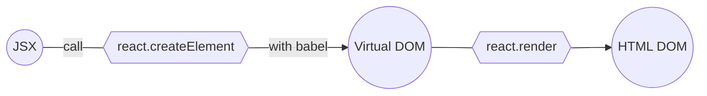
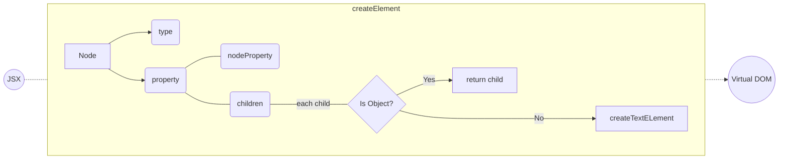

# A micro react

## Step0: How Jsx to HTML DOM

babel 会深度优先遍历 JSX 树，将 tag 标签， 属性 和 children 传递给 `react.reactElement()` 函数, 每遇到一个 JSX 标签都会调用一次， createElement 函数会被多次调用



## Step1: The createElement Function

each node structure like:

```plaintext
{
  ...
      {
        type: <HTML_Tag>
        property:{
          ...nodeProperty,
          children:[]
        }
      }
  ...
}
```

what createElement function does to each node:



A text node structure like this:

```javascript
{
  type: "TEXT_ELEMENT",
    props: {
      nodeValue: text,
      children: []
    }
}
```

## Step2: The Render Function

render function 目前的作用就是把 Virtual DOM 转化成真正的 HTML DOM，并且渲染到页面上

```javascript
function render(element, container) {
  const dom = element.type === "TEXT_ELEMENT"
    ? document.createTextNode("")
    : document.createElement(element.type)

  const isProperty = key => key !== "children"

  Object.keys(element.props)
    .filter(isProperty)
    .forEach(attributeKey => {
      dom[attributeKey] = element.props[attributeKey]
    })

  element.props.children.forEach(childNode => {
    render(childNode, dom)
  })

  container.appendChild(dom)
}
```


## reference

- [a DIY guide to build your own react by Rodrigo Pombo](https://engineering.hexacta.com/didact-learning-how-react-works-by-building-it-from-scratch-51007984e5c5)
- [Build your own react](https://pomb.us/build-your-own-react/)
